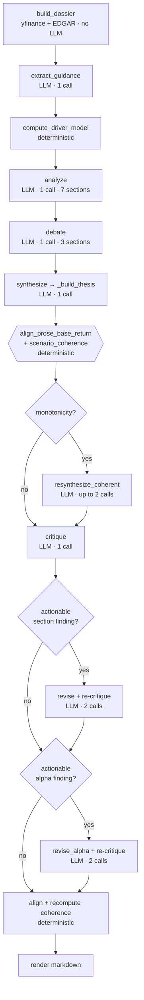

# Saturn Pipeline Anatomy — what a run actually does, and where the time goes

**Written:** 2026-07-15 · **Measured against:** `main` @ `9a88e0a`, Opus 4.8, live MRVL/MSFT/AMZN runs.

Purpose: dissect one `saturn research <TICKER>` run so we can see **why it takes 6–12 minutes**, what is
safe to **trim**, and what is worth **improving**. Numbers below are marked **measured** or **inferred** —
nothing here is guessed silently.

---

## 1. The shape of a run

Ingestion builds a provenance-tagged dossier (network, no LLM). Then `run()` executes a **strictly
sequential** chain of agents. The core design principle throughout: **the LLM supplies judgment, code
computes and checks the numbers.**

### Deterministic vs LLM

| Deterministic (free, instant) | LLM (slow, costly) |
|---|---|
| dossier build, metrics, driver model + waterfall | `extract_guidance` |
| scenario **pricing** (`value × multiple`) | `analyze`, `debate` |
| **stance derivation** (`_derive_stance`) | `synthesize` / `resynthesize_coherent` |
| `scenario_coherence` (4 checks) | `critique` |
| `align_prose_base_return` | `revise`, `revise_alpha` |
| completeness gate, render | |

The deterministic half is effectively **free**. **100% of the runtime is the LLM chain.**

---

## 2. The LLM call budget

There are **8 `llm.complete` call sites** in the codebase.

| Stage | Calls | When |
|---|---|---|
| `extract_guidance` | 1 | always |
| `analyze` | 1 | always |
| `debate` | 1 | always |
| `synthesize` | 1 | always |
| `critique` | 1 | always |
| **Baseline** | **5** | every report |
| `resynthesize_coherent` | 0–2 | only if a **monotonicity** issue |
| `revise` + re-`critique` | 0 or 2 | if an actionable section finding |
| `revise_alpha` + re-`critique` | 0 or 2 | if an actionable alpha finding |
| **Worst case** | **11** | |

Observed: the first successful MRVL run made **7** calls (baseline 5 + one repair loop).

---

## 3. Where the time actually goes

**Measured** (MRVL, Opus 4.8, one sample each, via direct stage instrumentation):

| Stage | Time | Note |
|---|---|---|
| `extract_guidance` | **1.2s** | tiny output (`_MAX_OUTPUT_TOKENS = 2048`), often returns `None` |
| `analyze` | **94.3s** | ⬅ **the single biggest cost** — 7 sections in one call |
| `debate` | **42.6s** | 3 sections |
| `synthesize` | **27.3s** | one JSON thesis |
| *subtotal* | **165.4s** | |

**Observed totals:** MRVL ≈ **590s** · MSFT + AMZN ≈ **720s for both** (~360s each).

**Inferred** (not individually instrumented): the remaining **~425s** of the MRVL run is `critique`
plus repair loops. With ~5 calls in that window, that implies **~85s/call** — consistent with `analyze`'s
measured 94s. So **`critique` ≈ 60–90s**, and **each repair loop ≈ 2–3 minutes** (revise + full re-critique).

### Size drivers

| Quantity | Value |
|---|---|
| `_company_context` per call | **55,330 chars ≈ 13.8k tokens** |
| Calls embedding that context | **all except `extract_guidance`** (analyze, debate, synthesize, resynthesize, critique, revise, revise_alpha) |
| Input tokens re-sent per run | **~55k baseline → ~124k worst case** |
| `_MAX_OUTPUT_TOKENS` | 8192 (analysis / synthesist / critic), 2048 (guidance) |
| `analyze` output | 7 multi-paragraph sections **in a single call** |
| Final report | 86–108 KB |

---

## 4. Why it's slow — five root causes

1. **Strictly sequential.** Every call blocks the next. Wall-clock is the **sum**, not the max. Nothing
   runs concurrently anywhere in `run()`.
2. **Output-token bound.** LLM latency is dominated by *generation*, not input. `analyze` writes 7
   multi-paragraph sections in one call (up to 8192 tokens) → ~94s. This one call is ~26% of a 360s run.
3. **The same 13.8k-token context is re-sent on every call, uncached.** 4–9 copies per run. No prompt
   caching is configured (`Anthropic(api_key=...)` uses stock defaults — no `cache_control`).
4. **Repairs re-run a *full* critique.** Each repair loop = `revise` + a complete re-`critique` of
   *everything*, even though only one or two sections changed. Two loops = 4 expensive calls ≈ 4–6 min.
5. **Opus 4.8 for everything** — including mechanical work (`extract_guidance` is pure JSON extraction;
   `revise` is targeted text surgery). We pay top-tier latency for tasks that don't need top-tier judgment.

---

## 5. Trim opportunities — ranked by impact ÷ effort

| # | Change | Est. saving | Effort | Risk |
|---|---|---|---|---|
| 1 | **Prompt caching** on `_company_context` (Anthropic `cache_control`) | Large on input cost + TTFT; the context is *identical* across 4–9 calls in a run | Low — client-level | Low |
| 2 | **Parallelize `analyze` ‖ `debate`** | **~43s (~12%)** | Low | Low |
| 3 | **Model tiering** — Haiku for `extract_guidance` (and possibly `revise`) | seconds + cost | Low | Low |
| 4 | **Scope the re-critique** to only revised sections | ~60–90s per repair loop | Medium | Medium — weakens the keep-if-better score comparison, which is computed over *all* findings |
| 5 | **Split `analyze` into parallel per-section calls** | wall-clock → slowest section instead of the sum (potentially **−60s**) | Medium/High | Medium — more calls, more failure modes, loses cross-section coherence |

**#2 is verified safe:** `analyze(company, llm, ...)` and `debate(company, llm, ...)` both take **only
`company`** — `debate` does *not* consume `analysis`. They are genuinely independent; only `synthesize`
needs both. Running them concurrently is a pure win.

**#1 is the biggest cheap win.** Nothing about the pipeline requires re-uploading 13.8k tokens 4–9 times.

**#4 carries a real caveat** — `_score(review)` sums severity across *all* findings, and the
keep-if-better gate depends on comparing full-review scores. Scoping the re-critique changes that
comparison's meaning. Don't do this casually.

### What NOT to trim
- **The deterministic layer** (coherence checks, stance derivation, prose alignment, driver model). It
  costs ~0ms and is exactly what makes the output trustworthy. Every hardening slice has moved work
  *from* the LLM *to* here — that direction is correct.
- **The Critic.** It's expensive (~60–90s) but it's the only thing auditing numbers against source data.

---

## 6. Room for improvement — correctness, not speed

Ranked by how much they distort output today:

1. **Fiscal-year-aware NTM blending** ⬅ *highest*. `forward_eps_ntm` / `forward_revenue` use yfinance's
   `0y` (current fiscal year) row. That is a valid "next twelve months" proxy **only early in a fiscal
   year**. For a company late in (or just past) its FY, `0y` collapses toward TTM and *understates*
   consensus. Live evidence (2026-07-15):
   - **MSFT** (FY ends June): consensus growth reads **+3.5%** vs TTM — but yfinance's own `0y` growth is
     **+17.0%**. Using `+1y` ($384.5B) gives **+20.8%**, the real forward number.
   - The artifact **flips the EPS-gap sign**: MSFT reads Saturn *above* consensus (`+$2.04`); with the
     horizon-correct `+1y` EPS it'd be `−$0.51`. AMZN shows the same pattern (`+$0.71` on `0y`; would be
     `−$0.52` on `+1y`).
   - Proper fix: the standard NTM construction — time-weight `0y` and `+1y` by fiscal-year progress
     (`3 months left → ¼·FY0 + ¾·FY1`), which needs the fiscal-year-end date.
2. **Run-to-run view variance.** MRVL's base case drew **+1% / −47% / −47% / +4%** across samples on
   identical data. The coherence layer makes each *individual* report self-consistent; it does **not**
   stabilize the view. Separate problem, currently unaddressed.
3. **Two-lens caveat vs. waterfall duplication.** When the waterfall is present, the Driver Bridge can
   still print a two-lens "consensus implies X% — extreme" caveat computed on a different basis (AVGO:
   waterfall said +40.5%, caveat said 92%). Reads as self-contradictory; suppress the caveat when the
   waterfall is available.
4. **Concept-aware grounding** (long-standing backlog). The Critic's numeric grounding matches magnitudes
   without checking the concept, so "$2B revenue" can ground against an unrelated $2B cash-flow figure.

---

## 7. Suggested order

1. **Fiscal-year-aware NTM blending** — a live correctness bug that silently flips a headline number.
2. **Prompt caching + parallelize analyze ‖ debate** — cheap, low-risk, together the bulk of the easy speed win.
3. **Model tiering for `extract_guidance`.**
4. Then reassess; leave #4/#5 trims and the variance problem until the above land.

---

## Appendix — how these numbers were measured

- **Stage timings:** load a pickled dossier, call each stage directly with a real `AnthropicClient`,
  wrap in `time.time()`. (Building the dossier separately also dodges intermittent yfinance hangs.)
- **Context size:** `len(_company_context(dossier))`; tokens ≈ chars ÷ 4.
- **Call budget:** `grep -rn "llm.complete" saturn/` → 8 sites; branch conditions read from `run()`.
- **Caveat:** each stage timing is a **single sample** on one ticker. Opus latency varies run to run.
  `critique` / `revise` / `revise_alpha` / `resynthesize_coherent` are **not yet instrumented** — that is
  the obvious next measurement, since repair loops are the largest *inferred* cost.
